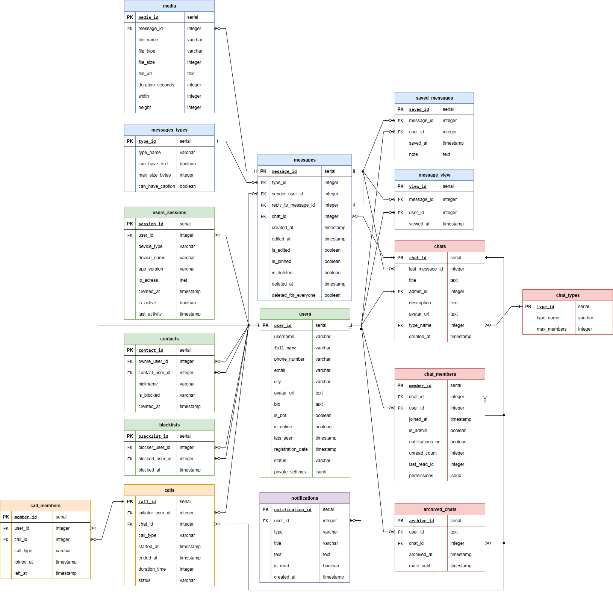

База данных для мессенджера с поддержкой чатов, сообщений, медиафайлов, звонков и уведомлений.

## Основные таблицы
- users - пользователи
- users_sessions - сессии пользователя
- contacts - контакты
- blacklist - черный список
- chats - чаты
- chat_members - участники чатов
- archived_chats - заархивированные чаты
- messages - сообщения
- messages_view - просмотры сообщений
- saved_messages - сохраненные сообщения
- media - медиафайлы
- notifications - уведомления
- calls - звонки

## Вспомогательные чаты
- chat_types - типы чатов
- messages_types - типы сообщений

## Связи

1:N: users → messages, chats → messages
M:N: users ↔ chats (через chat_members), users ↔ messages (через saved_messages/messages_view)

## Нормальные формы
1НФ: все поля атомарны, есть первичные ключи

2НФ: нет частичных зависимостей от составных ключей

3НФ: нет транзитивных зависимостей

## Схема БД
Для лучшего восприятия структуры БД была разработна схема связей:

