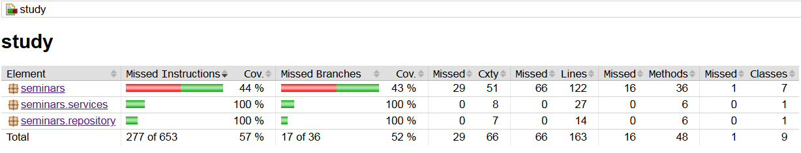

# Поркытие тестами

Общее покрытие кода тестами составляет 57% (277 из 653 инструкций покрыто). Покрытие ветвлений - 52%.



Были разработаны Unit, Mock и Integration тесты для ConstellationRepository и SpaceOperationCenterService.

Используемые технологии:
- JUnit 5 - основной фреймворк для тестирования;

- Mockito - создание мок-объектов и верификация вызовов;

- Spring Boot Test - интеграционное тестирование с контекстом Spring;

- JaCoCo - анализ покрытия кода.

```PowerShell
PS C:\Users\R2\IdeaProjects\study> ./gradlew test

[Incubating] Problems report is available at: file:///C:/Users/R2/IdeaProjects/study/build/reports/problems/problems-report.html

Deprecated Gradle features were used in this build, making it incompatible with Gradle 9.0.

You can use '--warning-mode all' to show the individual deprecation warnings and determine if they come from your own scripts or plugins.

For more on this, please refer to https://docs.gradle.org/8.14/userguide/command_line_interface.html#sec:command_line_warnings in the Gradle documentation.

BUILD SUCCESSFUL in 1s
```