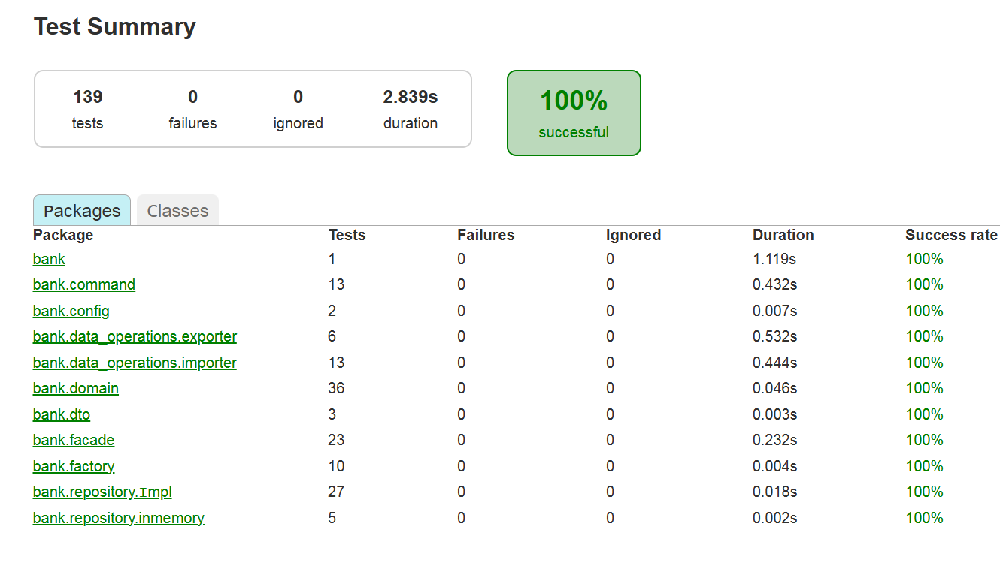
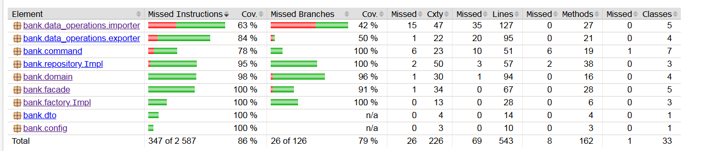

Программа моделирует упрощённую банковскую систему для ведения личных финансов. Она позволяет пользователю управлять банковскими счетами, категориями доходов и расходов, а также операциями по счетам. Основные сущности:

**BankAccount** - содержит уникальный идентификатор, название, текущий баланс, валюту, даты создания и обновления, а также список операций по счёту. Поддерживает методы пополнения (deposit), снятия (withdraw) и пересчёта баланса (recalculateBalance).

**Category** — группирует операции по типу (доход или расход) и имеет название и описание.

**Operation** — фиксирует движение средств: тип (доход/расход), сумму, дату, описание, привязку к счёту и опционально к категории.

# Функциональность:

- CRUD для счетов, категорий, операций.

- Аналитика: подсчёт доходов/расходов за период, группировка по категориям, вывод отчёта.

- Импорт/экспорт данных в форматах JSON, YAML, CSV.

- Автоматический и ручной пересчёт баланса при несоответствии.

- Измерение времени выполнения пользовательских сценариев (через команды).

# codesytle
В проекте соблюдаются общепринятые соглашения Java и единый стиль кодирования:

- Именование классов - PascalCase (BankAccount, AnalyticsService);

- Именование методов и переменных - camelCase (createAccount, accountBalance);

- Константы — UPPER_SNAKE_CASE (MAX_TRANSACTION_AMOUNT);

- Пакеты — нижний регистр, иерархия отражает модули: bank.domain, bank.service, bank.runner;

- Форматирование — используется стандартный отступ в 4 пробела, фигурные скобки открываются на той же строке (K&R стиль).

- Lombok — применяется для сокращения шаблонного кода: аннотации @Data, @Builder, @NoArgsConstructor, @AllArgsConstructor для моделей; @Slf4j для логирования.

Пример:

```java
import lombok.Builder;
import lombok.Data;

@Data
@Builder
public class BankAccount {
    private String id;
    private String name;
    private BigDecimal balance;
    private String currency;
    private LocalDateTime createdAt;
    private LocalDateTime updatedAt;
}
```
Код отформатирован с помощью встроенных средств IntelliJ IDEA, 
что обеспечивает единообразие.

# Фабричный метод (Factory Method)
Цель: инкапсулировать создание объектов доменной модели,
изолировать логику инициализации.

Реализация:

Интерфейс UniversalFactory с методом <T> T create(Object... params).

Конкретные фабрики: BankAccountFactory, CategoryFactory, 
OperationFactory (в пакете bank.factory.Impl).

Каждая фабрика отвечает за создание объектов соответствующего типа,
выполняя валидацию и установку обязательных полей.

Пример (BankAccountFactory):

```java
@Component
public class BankAccountFactory implements UniversalFactory {
@Override
public BankAccount create(Object... params) {
// проверка параметров, создание с валидацией
return new BankAccount(name, currency);
}
}
```

Фабрики используются в фасадах вместо прямого вызова конструктора, 
что упрощает тестирование и позволяет централизованно управлять 
созданием объектов.

# Фасад (Facade)
Цель: предоставить унифицированный интерфейс к подсистеме, 
упростить работу с группами операций.

Реализация:

- AccountFacade — методы для работы со счетами: создание, обновление, 
удаление, получение, пересчёт баланса.

- CategoryFacade — методы для категорий (создание, обновление, удаление,
получение по типу).

- OperationFacade — методы для операций (создание, получение по счёту 
и периоду, все операции).

- AnalyticsFacade — формирование аналитических отчётов.

- ExportFacade — единая точка доступа к экспорту в разные форматы.

Каждый фасад скрывает детали работы с репозиториями и фабриками, 
предоставляя простой API для клиентского кода (например, ConsoleRunner).

Пример (AccountFacade):

```java
@Component
@RequiredArgsConstructor
public class AccountFacade {
private final AccountRepository accountRepository;
private final BankAccountFactory accountFactory;

    public BankAccount createAccount(String name, String currency) {
        validateAccountName(name);
        BankAccount account = accountFactory.create(name, currency);
        return accountRepository.save(account);
    }
    // ...
}
```

# Команда (Command)
Цель: представить каждый пользовательский сценарий как объект команды, 
что позволяет параметризовать, логировать и измерять время выполнения.

Реализация:

- Интерфейс Command с методами execute(), getDescription(), isExecuted().

- Абстрактный класс BaseCommand, реализующий проверку на повторное 
выполнение и метод undo (по умолчанию не поддерживается).

- Конкретные команды: CreateAccountCommand, CreateCategoryCommand, 
CreateOperationCommand, RecalculateBalanceCommand, ExportDataCommand.

- CommandFactory создаёт команды с необходимыми зависимостями (фасады) 
и параметрами.

Пример (CreateAccountCommand):

```java
public class CreateAccountCommand extends BaseCommand {
private final AccountFacade accountFacade;
private final String name;
private final String currency;
// ...

    @Override
    public void execute() {
        validateNotExecuted();
        var account = accountFacade.createAccount(name, currency);
        this.createdAccountId = account.getId();
        this.executed = true;
    }
}
```
Команды используются в ConsoleRunner для обработки пользовательского 
ввода, что делает код более структурированным и открытым для расширения
(легко добавить новую команду).

# Шаблонный метод (Template Method)
Цель: определить общий алгоритм импорта данных, оставив вариативные части
(парсинг) подклассам.

Реализация:

- Абстрактный класс DataImporter содержит шаблонный метод 
importData(String filePath), который вызывает абстрактные методы 
parseAccounts, parseCategories, parseOperations, а затем общие методы 
validateData, saveData, postProcess.

- Конкретные импортёры: JsonDataImporter, YamlDataImporter (наследуют 
AbstractStructuredDataImporter, который реализует парсинг через Jackson), CsvDataImporter (наследует DataImporter и реализует парсинг через OpenCSV).

- Экспорт также построен по шаблонному методу: абстрактный DataExporter
с методом exportData и абстрактными методами writeAccounts, 
writeCategories, writeOperations.

Пример (DataImporter):

``` java
public abstract class DataImporter {
public final void importData(String filePath) {
List<BankAccount> accounts = parseAccounts(filePath);
List<Category> categories = parseCategories(filePath);
List<Operation> operations = parseOperations(filePath);
validateData(accounts, categories, operations);
saveData(accounts, categories, operations);
postProcess();
}
protected abstract List<BankAccount> parseAccounts(String filePath);
// ...
}
```
Такой подход устраняет дублирование кода и позволяет легко добавлять
новые форматы (достаточно создать новый подкласс).

# Модульное тестирование
Проект покрыт модульными тестами с использованием JUnit 5 и Mockito. Тесты расположены в директории src/test/java.

Используемые инструменты:

JUnit 5 - основа для написания тестов (аннотации @Test, @BeforeEach, @ExtendWith).

Mockito - создание заглушек для зависимостей (@Mock, @InjectMocks, when, verify).

JaCoCo - отчет о покрытии кода тестами

Общее покрытие: 86% инструкций, 79% ветвлений.

[index.html](build/reports/jacoco/test/html/index.html) - файл отчета расположен ../hw2/build/reports/jacoco/test/html/index.html



Для исключения сгенерированного Lombok кода из отчёта добавлен файл lombok.config:

properties
lombok.addLombokGeneratedAnnotation = true
Пример теста:

```java
@Test
void createAccount_Success() {
    when(accountRepository.existsByName("Основной")).thenReturn(false);
    when(accountRepository.save(any(BankAccount.class))).thenAnswer(inv -> inv.getArgument(0));

    BankAccount account = bankService.createAccount("Основной", "RUB");

    assertNotNull(account);
    assertEquals("Основной", account.getName());
    assertEquals(BigDecimal.ZERO, account.getBalance());
    verify(accountRepository).save(account);
}
```

# Принципы SOLID
В проекте применяются принципы SOLID. Рассмотрим каждый на примерах.

**Single Responsibility Principle**
Каждый класс имеет одну ответственность: BankAccount хранит данные, 
AccountFacade управляет счетами, JsonDataImporter только импортирует JSON.

**Open/Closed Principle**
Классы открыты для расширения (новые импортёры, команды, фасады) и закрыты
для модификации. Например, для добавления нового формата импорта достаточно
создать подкласс DataImporter.

**Liskov Substitution Principle**
Все реализации интерфейсов репозиториев (AccountRepositoryImpl, ...Impl) взаимозаменяемы.
Фасады работают с интерфейсами, а не конкретными классами.

**Interface Segregation Principle** (Принцип разделения интерфейсов)
Все реализации интерфейсов репозиториев (AccountRepositoryImpl, ...)
взаимозаменяемы. Фасады работают с интерфейсами, а не конкретными классами.

**Dependency Inversion Principle**
Модули верхнего уровня (фасады, команды) зависят от абстракций 
(интерфейсов репозиториев, фабрик), а не от конкретных реализаций. Зависимости 
внедряются через DI-конструктор.

# Принципы GRASP
- высокая связность: Каждый класс выполняет строго 
определённые функции. Например, AnalyticsFacade занимается только 
аналитикой, OperationFacade — только операциями.

- низкая связанность: Классы слабо связаны благодаря
использованию интерфейсов и DI. Фасады общаются через репозитории, 
а не напрямую друг с другом. Изменение в одном модуле минимально влияет
на другие.

- Controller: ConsoleRunner выступает как контроллер, обрабатывающий 
пользовательский ввод и делегирующий команды.

- Creator: Фабрики (BankAccountFactory и др.) отвечают за создание
объектов.

- Indirection: Введение фасадов и команд создаёт прослойку между
клиентом и подсистемой, снижая связанность.

# Реализация взаимодействия модулей через DI-контейнер
В качестве DI-контейнера используется Spring Framework (Spring Boot). Все сервисы и репозитории являются Spring-бинами, управляемыми контейнером.

Конфигурация:

В build.gradle.kts подключён стартер spring-boot-starter.

Аннотации @Service, @Repository помечают классы как кандидаты для автоматического обнаружения.

Главный класс BankApplication аннотирован @SpringBootApplication, что включает сканирование пакетов.

Внедрение зависимостей через конструктор:

```java
@Component
@RequiredArgsConstructor
public class OperationFacade {
    private final OperationRepository operationRepository;
    private final OperationFactory operationFactory;
    private final AccountFacade accountFacade;
    private final CategoryFacade categoryFacade;
}
```

Тестирование с профилями:
Для предотвращения запуска ConsoleRunner во время тестов используется профиль test:

```java
@Component
@Profile("!test")
public class ConsoleRunner implements CommandLineRunner { ... }
```
В соответствующих тестовых классах добавлена аннотация @ActiveProfiles("test").

#  CRUD операции для счетов, категорий, операций
Все CRUD-операции реализованы в соответствующих фасадах:

- Счета: createAccount, updateAccount, deleteAccount, getAccount, 
getAllAccounts.

- Категории: create, updateCategory, deleteCategory, getCategory, 
getAllCategories, getCategoriesByType.

- Операции: createOperation, getAccountOperations, getAllOperations, deleteById.

- Репозитории (AccountRepositoryImpl и др.) обеспечивают хранение в 
памяти с использованием ConcurrentHashMap.

# Реализация всех функциональных требований

| Требование                                                                                                                                    | 	Реализация                                                                           |
|-----------------------------------------------------------------------------------------------------------------------------------------------|---------------------------------------------------------------------------------------|
| Создание, редактирование, удаление                                                                                                            | 	AccountFacade                                                                        |
| Создание, редактирование, удаление категорий                                                                                                  | 	CategoryFacade                                                                       |
| Создание, редактирование, удаление операций                                                                                                   | 	OperationFacade                                                                      |
| Аналитика: разница доходов/расходов за период	                                                                                                | AnalyticsFacade.generateReport                                                        |
| Группировка по категориям	                                                                                                                    | AnalyticsFacade.generateReport - groupByCategory                                      |
| Экспорт в JSON, YAML, CSV	                                                                                                                    | ExportFacade: JsonDataExporter, YamlDataExporter, CsvDataExporter                     |
| Импорт из JSON, YAML, CSV | 	JsonDataImporter, YamlDataImporter, CsvDataImporter                                  |                                                           
| Пересчёт баланса (автоматический и ручной)	| BankAccount.autoRecalculateIfNeeded (авто), AccountFacade.recalculateBalance (ручной) |             
| Измерение времени пользовательских сценариев	| Реализовано через паттерн Декоратор для команд. Каждая команда, создаваемая через CommandFactory, оборачивается в TimedCommandDecorator, который замеряет время выполнения и выводит его в консоль|

# Ситуации, при которых возникнут проблемы при добавлении нового функционала
Несмотря на применение паттернов, есть потенциальные узкие места:

- Добавление нового типа сущности (например, «Кредит»). Потребуется создание 
нового репозитория, фасада, фабрики и, возможно, модификация команд. 
Это потребует изменений во многих местах.

- Изменение логики валидации (например, новые правила для создания счёта).
Сейчас валидация размазана по фасадам. Если правил станет много, 
фасады разрастутся. Лучше вынести валидацию в отдельные классы.

- Расширение аналитики новыми отчётами. Придётся добавлять методы
в AnalyticsFacade, что может привести к его разрастанию.
Решение — использовать паттерн Стратегия для каждого типа отчёта.

- Смена хранилища (например, переход на БД). Потребуется реализовать 
новые репозитории, но благодаря интерфейсам это не затронет фасады.

- Добавление нового формата импорта легко — достаточно 
создать подкласс DataImporter. Это преимущество, а не проблема.

# Аргументы, почему введённые абстракции улучшили дизайн
- Фабрики отделили создание объектов от бизнес-логики, 
упростили тестирование и позволили централизованно управлять валидацией.

- Фасады скрыли сложность работы с репозиториями и фабриками,
предоставив простой и понятный API. Каждый фасад отвечает 
за свою предметную область, что повышает связность и снижает связанность.

- Команды инкапсулировали пользовательские сценарии, 
сделав код ConsoleRunner чистым и легко расширяемым. 
Команды можно легко декорировать (логирование, измерение времени).

- Шаблонный метод в импортерах/экспортерах устранил 
дублирование кода и упростил добавление новых форматов.

- Интерфейсы репозиториев позволили легко 
переключаться между Impl и другими реализациями, а также упростили тестирование.

- DI-контейнер обеспечил слабую связанность и управляемость зависимостями.

Проект полностью удовлетворяет поставленным требованиям: реализованы все паттерны 
(Фабричный метод, Фасад, Команда, Шаблонный метод), соблюдены SOLID и GRASP, 
используется DI-контейнер, выполнены функциональные требования, написаны модульные тесты.
Архитектура готова к дальнейшему расширению.

### Дополнительная информация:

Для запуска приложения используйте ./gradlew --console=plain bootRun.

Тесты запускаются командой ./gradlew test, отчёт о покрытии JaCoCo доступен в build/reports/jacoco/test/html/index.html.

В случае проблем с языков в консоли:
chcp 65001
[Console]::OutputEncoding = [System.Text.Encoding]::UTF8


Результат работы программы:
PS C:\Lena\учеба\uni\Индустриальная разработка ПО (Бюро)\System Design\hw\hw2> ./gradlew --console=plain bootRun
> Task :compileJava UP-TO-DATE
> Task :processResources UP-TO-DATE
> Task :classes UP-TO-DATE
> Task :resolveMainClassName UP-TO-DATE

> Task :bootRun

.   ____          _            __ _ _
/\\ / ___'_ __ _ _(_)_ __  __ _ \ \ \ \
( ( )\___ | '_ | '_| | '_ \/ _` | \ \ \ \
\\/  ___)| |_)| | | | | || (_| |  ) ) ) )
'  |____| .__|_| |_|_| |_\__, | / / / /
=========|_|==============|___/=/_/_/_/
:: Spring Boot ::                (v3.2.0)

2026-02-16T11:26:54.195+03:00  INFO 20848 --- [           main] bank.BankApplication                     : Starting BankApplication using Java 17.0.12 with PID 20848 (C:\Lena\учеба\uni\Индустриальная разработка ПО (Бюро)\System Design\hw\hw2\build\classes\java\main started by R2 in C:\Lena\учеба\uni\Индустриальная разработка ПО (Бюро)\System Design\hw\hw2)
2026-02-16T11:26:54.197+03:00  INFO 20848 --- [           main] bank.BankApplication                     : No active profile set, falling back to 1 default profile: "default"
2026-02-16T11:26:54.785+03:00  INFO 20848 --- [           main] bank.BankApplication                     : Started BankApplication in 0.899 seconds (process running for 1.215)

БАНКОВСКАЯ СИСТЕМА УПРАВЛЕНИЯ СЧЕТАМИ
===========================================

Создание тестовых данных...

СПИСОК СЧЕТОВ:
==================
ID: 52297fa7-ed51-4978-8f57-b8c8dd24e592 | Основной счет | Баланс: 80000.00 RUB | Операций: 3
ID: bbb526d0-4d15-4489-aebe-f2deaa1aec18 | Накопительный | Баланс: 5000.00 RUB | Операций: 1
==================


СПИСОК КАТЕГОРИЙ:
=====================
ID: 6857a40e-b0c3-4eb3-92e6-64415e2037eb | Зарплата | Тип: INCOME | Основной доход
ID: 0a9c7e2a-b56a-44df-b011-bee9feb06d26 | Кэшбэк | Тип: INCOME | Бонусы от банка
ID: fb039c24-c7fb-4da1-b602-575975855b87 | Транспорт | Тип: EXPENSE | Такси и общественный транспорт
ID: 1396f535-439d-4ce0-b4c9-9934e25e9be2 | Рестораны | Тип: EXPENSE | Кафе и рестораны
ID: 7596144a-3bef-4c7b-9d86-2e7d51ca6509 | Продукты | Тип: EXPENSE | Еда и напитки
=====================


СПИСОК ОПЕРАЦИЙ:
==========================
ID: 309c32fb-d3e2-4189-b521-c8a4a30413a9 | 2026-02-16 | INCOME | 100000.00 | Зарплата | Зарплата за январь
ID: 161ba9e9-19b5-4a79-a7d5-a06e6ed34cfb | 2026-02-16 | EXPENSE | 15000.00 | Транспорт | Продукты на месяц
ID: 4a197e02-7b99-4b3f-807e-111543e351d0 | 2026-02-16 | INCOME | 5000.00 | Без категории | Перевод с основного
ID: 48ec94a6-5652-43cd-a7b9-81cf17ecfc25 | 2026-02-16 | EXPENSE | 5000.00 | Рестораны | Такси
==========================

Тестовые данные созданы


ГЛАВНОЕ МЕНЮ
1. Управление счетами
2. Управление категориями
3. Управление операциями
4. Аналитика
5. Импорт/Экспорт
6. Проверка и пересчет балансов
0. Выход
   Выберите пункт: 5

ИМПОРТ/ЭКСПОРТ
1. Экспорт в JSON
2. Экспорт в YAML
3. Экспорт в CSV
4. Импорт из JSON
0. Назад
   Выберите пункт: 1
   Данные экспортированы в JSON: .\exports\json_20260216_112700

ИМПОРТ/ЭКСПОРТ
1. Экспорт в JSON
2. Экспорт в YAML
3. Экспорт в CSV
4. Импорт из JSON
0. Назад
   Выберите пункт: 2
   Данные экспортированы в YAML: .\exports\yaml_20260216_112703

ИМПОРТ/ЭКСПОРТ
1. Экспорт в JSON
2. Экспорт в YAML
3. Экспорт в CSV
4. Импорт из JSON
0. Назад
   Выберите пункт: 3
   Данные экспортированы в CSV: .\exports\csv_20260216_112705

ИМПОРТ/ЭКСПОРТ
1. Экспорт в JSON
2. Экспорт в YAML
3. Экспорт в CSV
4. Импорт из JSON
0. Назад
   Выберите пункт: 0

ГЛАВНОЕ МЕНЮ
1. Управление счетами
2. Управление категориями
3. Управление операциями
4. Аналитика
5. Импорт/Экспорт
6. Проверка и пересчет балансов
0. Выход
   Выберите пункт: 1

УПРАВЛЕНИЕ СЧЕТАМИ

СПИСОК СЧЕТОВ:
==================
ID: 52297fa7-ed51-4978-8f57-b8c8dd24e592 | Основной счет | Баланс: 80000.00 RUB | Операций: 3
ID: bbb526d0-4d15-4489-aebe-f2deaa1aec18 | Накопительный | Баланс: 5000.00 RUB | Операций: 1
==================

1. Создать счет
2. Редактировать счет
3. Удалить счет
4. Пересчитать баланс счета
0. Назад
   Выберите пункт: 1
   Название счета: Тестовый
   Валюта (RUB/USD/EUR): RUB

УПРАВЛЕНИЕ СЧЕТАМИ

СПИСОК СЧЕТОВ:
==================
ID: 8e9d518d-43ee-4695-8839-e1762ca40139 | Тестовый | Баланс: 0 RUB | Операций: 0
ID: 52297fa7-ed51-4978-8f57-b8c8dd24e592 | Основной счет | Баланс: 80000.00 RUB | Операций: 3
ID: bbb526d0-4d15-4489-aebe-f2deaa1aec18 | Накопительный | Баланс: 5000.00 RUB | Операций: 1
==================

1. Создать счет
2. Редактировать счет
3. Удалить счет
4. Пересчитать баланс счета
0. Назад
   Выберите пункт: 2

СПИСОК СЧЕТОВ:
==================
ID: 8e9d518d-43ee-4695-8839-e1762ca40139 | Тестовый | Баланс: 0 RUB | Операций: 0
ID: 52297fa7-ed51-4978-8f57-b8c8dd24e592 | Основной счет | Баланс: 80000.00 RUB | Операций: 3
ID: bbb526d0-4d15-4489-aebe-f2deaa1aec18 | Накопительный | Баланс: 5000.00 RUB | Операций: 1
==================

ID счета: 8e9d518d-43ee-4695-8839-e1762ca40139
Новое название: Демо

УПРАВЛЕНИЕ СЧЕТАМИ

СПИСОК СЧЕТОВ:
==================
ID: 8e9d518d-43ee-4695-8839-e1762ca40139 | Демо | Баланс: 0 RUB | Операций: 0
ID: 52297fa7-ed51-4978-8f57-b8c8dd24e592 | Основной счет | Баланс: 80000.00 RUB | Операций: 3
ID: bbb526d0-4d15-4489-aebe-f2deaa1aec18 | Накопительный | Баланс: 5000.00 RUB | Операций: 1
==================

1. Создать счет
2. Редактировать счет
3. Удалить счет
4. Пересчитать баланс счета
0. Назад
   Выберите пункт: 0

ГЛАВНОЕ МЕНЮ
1. Управление счетами
2. Управление категориями
3. Управление операциями
4. Аналитика
5. Импорт/Экспорт
6. Проверка и пересчет балансов
0. Выход
   Выберите пункт: 2

УПРАВЛЕНИЕ КАТЕГОРИЯМИ

СПИСОК КАТЕГОРИЙ:
=====================
ID: 6857a40e-b0c3-4eb3-92e6-64415e2037eb | Зарплата | Тип: INCOME | Основной доход
ID: 0a9c7e2a-b56a-44df-b011-bee9feb06d26 | Кэшбэк | Тип: INCOME | Бонусы от банка
ID: fb039c24-c7fb-4da1-b602-575975855b87 | Транспорт | Тип: EXPENSE | Такси и общественный транспорт
ID: 1396f535-439d-4ce0-b4c9-9934e25e9be2 | Рестораны | Тип: EXPENSE | Кафе и рестораны
ID: 7596144a-3bef-4c7b-9d86-2e7d51ca6509 | Продукты | Тип: EXPENSE | Еда и напитки
=====================

1. Создать категорию
2. Редактировать категорию
3. Удалить категорию
0. Назад
   Выберите пункт: 1
   Название категории: Хобби
   Тип (INCOME/EXPENSE): INCOME
   Описание: Перепродажа

УПРАВЛЕНИЕ КАТЕГОРИЯМИ

СПИСОК КАТЕГОРИЙ:
=====================
ID: 6857a40e-b0c3-4eb3-92e6-64415e2037eb | Зарплата | Тип: INCOME | Основной доход
ID: b3816193-fb61-4ea8-8a38-f0fad1471c29 | Хобби | Тип: INCOME | Перепродажа
ID: 0a9c7e2a-b56a-44df-b011-bee9feb06d26 | Кэшбэк | Тип: INCOME | Бонусы от банка
ID: fb039c24-c7fb-4da1-b602-575975855b87 | Транспорт | Тип: EXPENSE | Такси и общественный транспорт
ID: 1396f535-439d-4ce0-b4c9-9934e25e9be2 | Рестораны | Тип: EXPENSE | Кафе и рестораны
ID: 7596144a-3bef-4c7b-9d86-2e7d51ca6509 | Продукты | Тип: EXPENSE | Еда и напитки
=====================

1. Создать категорию
2. Редактировать категорию
3. Удалить категорию
0. Назад
   Выберите пункт: 2

СПИСОК КАТЕГОРИЙ:
=====================
ID: 6857a40e-b0c3-4eb3-92e6-64415e2037eb | Зарплата | Тип: INCOME | Основной доход
ID: b3816193-fb61-4ea8-8a38-f0fad1471c29 | Хобби | Тип: INCOME | Перепродажа
ID: 0a9c7e2a-b56a-44df-b011-bee9feb06d26 | Кэшбэк | Тип: INCOME | Бонусы от банка
ID: fb039c24-c7fb-4da1-b602-575975855b87 | Транспорт | Тип: EXPENSE | Такси и общественный транспорт
ID: 1396f535-439d-4ce0-b4c9-9934e25e9be2 | Рестораны | Тип: EXPENSE | Кафе и рестораны
ID: 7596144a-3bef-4c7b-9d86-2e7d51ca6509 | Продукты | Тип: EXPENSE | Еда и напитки
=====================

ID категории: b3816193-fb61-4ea8-8a38-f0fad1471c29
Новое название: Ресейл
Новое описание: Перепродажа старых вещей

УПРАВЛЕНИЕ КАТЕГОРИЯМИ

СПИСОК КАТЕГОРИЙ:
=====================
ID: 6857a40e-b0c3-4eb3-92e6-64415e2037eb | Зарплата | Тип: INCOME | Основной доход
ID: b3816193-fb61-4ea8-8a38-f0fad1471c29 | Ресейл | Тип: INCOME | Перепродажа старых вещей
ID: 0a9c7e2a-b56a-44df-b011-bee9feb06d26 | Кэшбэк | Тип: INCOME | Бонусы от банка
ID: fb039c24-c7fb-4da1-b602-575975855b87 | Транспорт | Тип: EXPENSE | Такси и общественный транспорт
ID: 1396f535-439d-4ce0-b4c9-9934e25e9be2 | Рестораны | Тип: EXPENSE | Кафе и рестораны
ID: 7596144a-3bef-4c7b-9d86-2e7d51ca6509 | Продукты | Тип: EXPENSE | Еда и напитки
=====================

1. Создать категорию
2. Редактировать категорию
3. Удалить категорию
0. Назад
   Выберите пункт: 0

ГЛАВНОЕ МЕНЮ
1. Управление счетами
2. Управление категориями
3. Управление операциями
4. Аналитика
5. Импорт/Экспорт
6. Проверка и пересчет балансов
0. Выход
   Выберите пункт: 3

УПРАВЛЕНИЕ ОПЕРАЦИЯМИ
1. Создать операцию
2. Просмотреть операции счета
3. Просмотреть все операции
0. Назад
   Выберите пункт: 2
   ID счета: 52297fa7-ed51-4978-8f57-b8c8dd24e592

ОПЕРАЦИИ:
2026-02-16 | EXPENSE | 5000.00 | Рестораны
2026-02-16 | INCOME | 100000.00 | Зарплата
2026-02-16 | EXPENSE | 15000.00 | Транспорт

УПРАВЛЕНИЕ ОПЕРАЦИЯМИ
1. Создать операцию
2. Просмотреть операции счета
3. Просмотреть все операции
0. Назад
   Выберите пункт: 1

СПИСОК СЧЕТОВ:
==================
ID: 8e9d518d-43ee-4695-8839-e1762ca40139 | Демо | Баланс: 0 RUB | Операций: 0
ID: 52297fa7-ed51-4978-8f57-b8c8dd24e592 | Основной счет | Баланс: 80000.00 RUB | Операций: 3
ID: bbb526d0-4d15-4489-aebe-f2deaa1aec18 | Накопительный | Баланс: 5000.00 RUB | Операций: 1
==================

ID счета: bb526d0-4d15-4489-aebe-f2deaa1aec18
Тип (INCOME/EXPENSE): INCOME
Сумма: 1200
Описание: Продажа кофеварки
ID категории (Enter для пропуска): b3816193-fb61-4ea8-8a38-f0fad1471c29
Ошибка: Счет с ID bb526d0-4d15-4489-aebe-f2deaa1aec18 не найден

УПРАВЛЕНИЕ ОПЕРАЦИЯМИ
1. Создать операцию
2. Просмотреть операции счета
3. Просмотреть все операции
0. Назад
   Выберите пункт: 0

ГЛАВНОЕ МЕНЮ
1. Управление счетами
2. Управление категориями
3. Управление операциями
4. Аналитика
5. Импорт/Экспорт
6. Проверка и пересчет балансов
0. Выход
   Выберите пункт: 4
   ID счета: 52297fa7-ed51-4978-8f57-b8c8dd24e592
   Начало периода (ГГГГ-ММ-ДД): 2000-10-10
   Конец периода (ГГГГ-ММ-ДД): 2026-01-01

АНАЛИТИКА ПО СЧЕТУ: Основной счет
Период: 2000-10-10 - 2026-01-01
===========================================
Доходы: 0 RUB
Расходы: 0 RUB
Итого: 0 RUB

Доходы по категориям:
Расходы по категориям:

ТОП-5 КРУПНЫХ ОПЕРАЦИЙ:
===========================================


ГЛАВНОЕ МЕНЮ
1. Управление счетами
2. Управление категориями
3. Управление операциями
4. Аналитика
5. Импорт/Экспорт
6. Проверка и пересчет балансов
0. Выход
   Выберите пункт: 6

ПРОВЕРКА БАЛАНСОВ ВСЕХ СЧЕТОВ:
===================================
Счет 'Демо': баланс корректен (0)
Счет 'Основной счет': баланс корректен (80000.00)
Счет 'Накопительный': баланс корректен (5000.00)
===================================

Хотите пересчитать все балансы? (да/нет): нет

ГЛАВНОЕ МЕНЮ
1. Управление счетами
2. Управление категориями
3. Управление операциями
4. Аналитика
5. Импорт/Экспорт
6. Проверка и пересчет балансов
0. Выход
   Выберите пункт: 0
   До свидания!